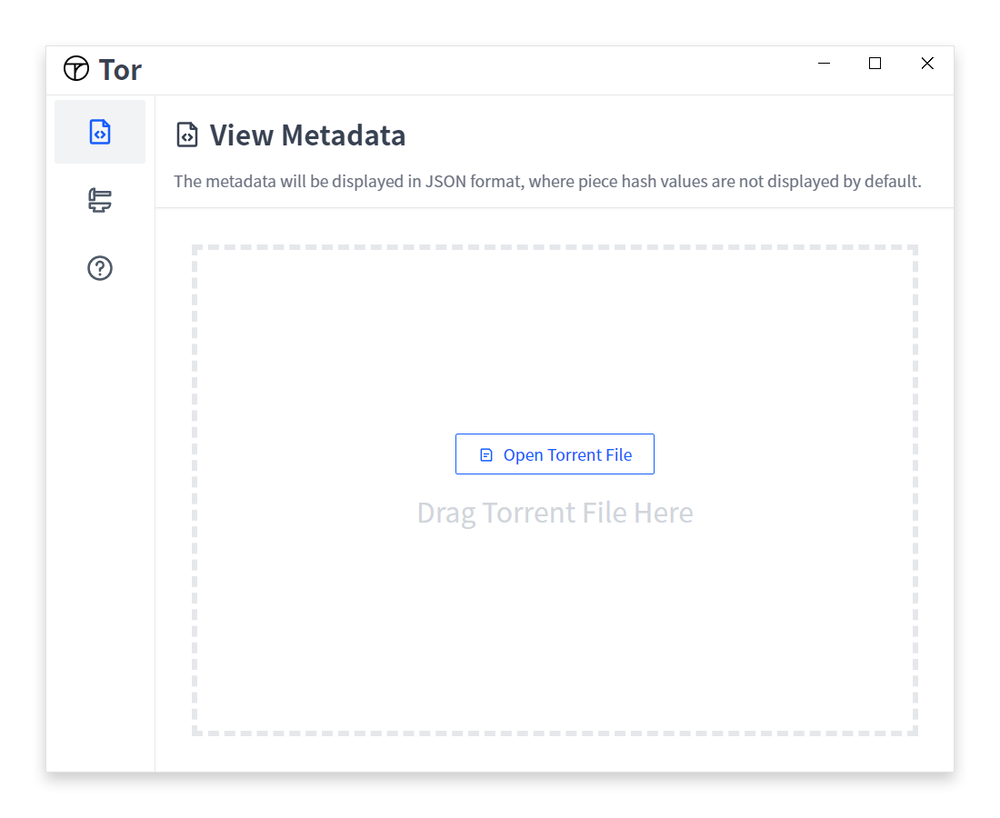
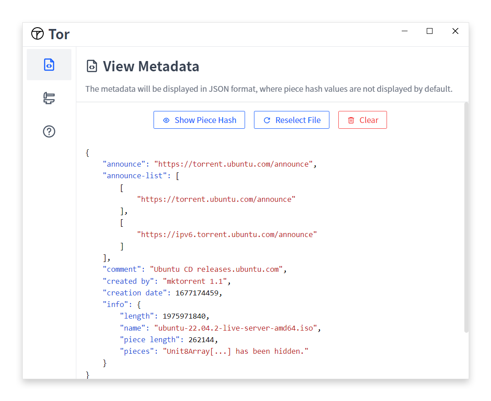
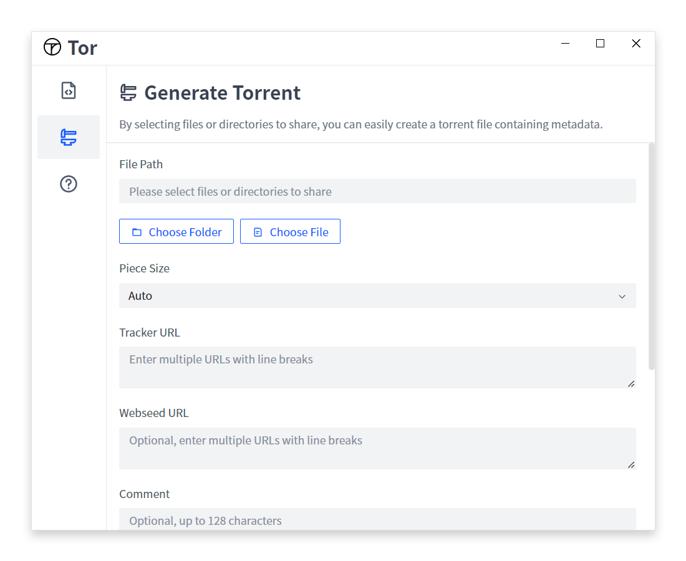
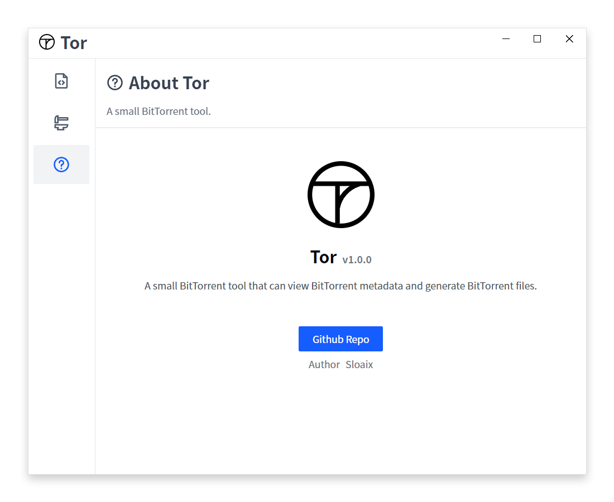

# Tor - Bittorrent Utility

[简体中文](./README_hans.md) | [English](./README.md)

Tor is an open-source software written using the Electron framework. It is a utility for viewing BitTorrent metadata and generating BitTorrent files.

## Features

- View BitTorrent metadata: Tor allows users to load and view metadata of BitTorrent files, including file lists, file sizes, hash values, and other information.
- Generate BitTorrent files: Tor provides a simple and intuitive interface for users to easily generate BitTorrent files.

## Installation

Please visit the [releases](https://github.com/sloaix/tor/releases)  page to download and install the package suitable for your operating system.

## License

Tor is an open-source software released under the [Apache License 2.0](https://opensource.org/licenses/Apache-2.0).
