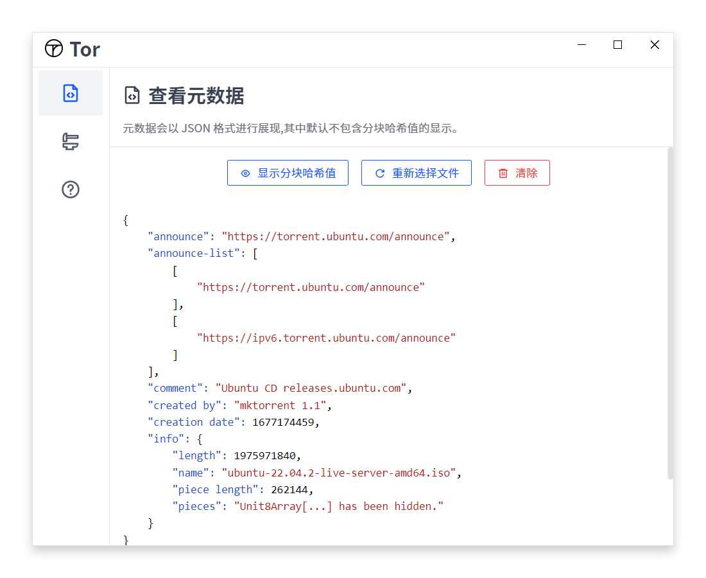
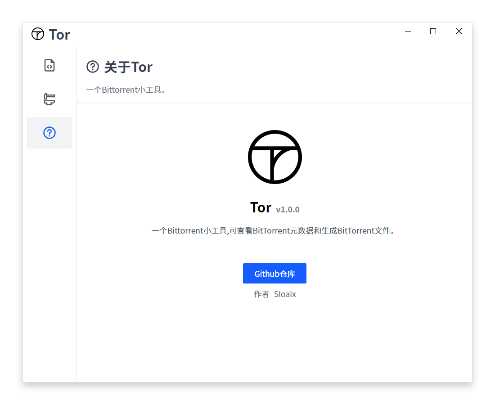

# Tor - Bittorrent 工具

Tor是一个使用Electron框架编写的开源软件，它是一个用于查看BitTorrent元数据和生成BitTorrent文件的工具。

## 功能特点

- 查看BitTorrent元数据：Tor允许用户加载和查看BitTorrent文件的元数据，包括文件列表、文件大小、哈希值等信息。
- 生成BitTorrent文件：Tor提供了一个简单而直观的界面，让用户能够轻松地生成BitTorrent文件。

## 安装

请前往 [releases](https://github.com/sloaix/tor/releases) 页面选择适合您的操作系统的安装包进行下载并安装。

## 许可证

Tor是基于 [Apache License 2.0](https://opensource.org/licenses/Apache-2.0) 发布的开源软件。
